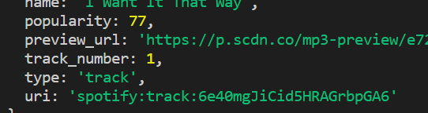

# liri-node-app

 this app is mean to showcase how to call data on the backend side of things.
 We are able to do this by downloading Package.json and using axios cass to get specific information.
 API's used for this app are:
 
 1. Spotify API
 2. Bands in Town API
 3. OMDB API

 First I made sure to download all the packages that I needed by doing *npm install package json* 
 Second I downloaded the nessesary dependincies 
 "axios": "^0.19.0",
    "dotenv": "^8.0.0",
    "fs": "0.0.1-security",
    "moment": "^2.24.0",
    "node-spotify-api": "^1.1.1"

### how to use
To search for movies go to terminal and type node liri2.js movie-this and the following information will be pulled.

This is done by creating a function that asks axios to search and fetch the filtered information below 

To save time I created a **switch function** as oppose to a **if and else** 

### Spotify and bands in town examples

To call on information for **Bands in town** type node liri2.js concert-this

Using **moment** I was able to make the tour dates more readable

To call on information for **Spotify** type node liri2.js spotify-this-song

Finally, to call a command from the random.txt file
